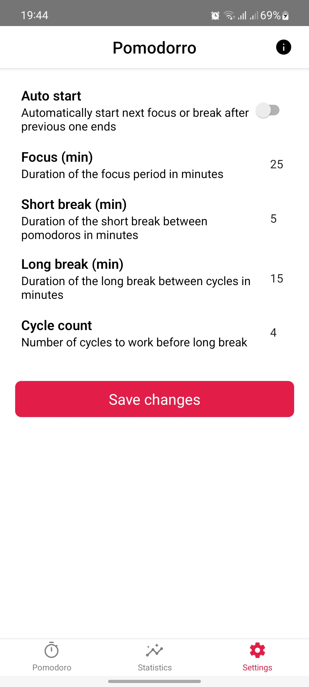

# Pomodorro

Simple, lightweight and customizable Pomodoro timer built with React Native

## Features
- Customize duration of focus time, short and long breaks
- Auto starting of the next focus/break
- Customizable number of cycles
- Portrait and landscape friendly
- Background service that keeps running even when activity is closed
- Ongoing notification with countdown
- Transition notifications that are automatically dismissed when auto start is enabled
- Statistics tracking

## Screenshots

| Main screen | Stat screen | Pref screen | About screen |
|---|---|---|---|
|  |  |  |  |


## Requirements
- Node v16+ https://nodejs.org/en/
- JDK v11+ https://openjdk.org/
- Android studio and Android SDK Platform 31 https://reactnative.dev/docs/environment-setup

## Development

Initializing project:

```bash
npm install
```

Starting metro server:

```bash
npm start
```

Starting application on device or emulator (Android):

```bash
npm run android
```
